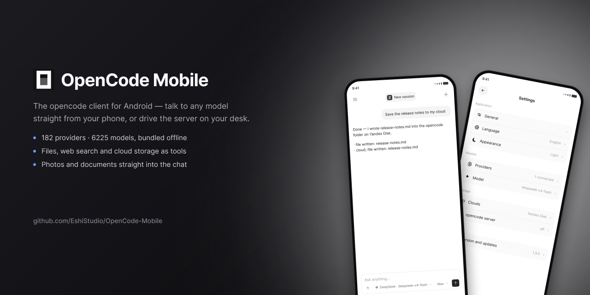

# OpenCode Mobile

An Android client for [opencode](https://opencode.ai). It works two ways:

- **straight to a provider** — you enter an API key in the app and requests go from the phone;
- **through an opencode server** on your computer — sessions, projects and tools come from the PC.

Built with Expo (bare workflow) and React Native. The interface ships in English and Russian.

## Features

- A catalog of 182 providers and 6225 models from the [models.dev](https://models.dev) registry, bundled into the build so the list works offline. Providers with an OpenAI-compatible HTTP API are supported.
- Tools the model can call: files in the app sandbox, web search and page fetching, cloud storage, and the app's own settings.
- Cloud storage: Yandex Disk, Google Drive, Dropbox. Google and Dropbox use OAuth with PKCE; Yandex takes a manual token.
- Attachments: photos, media and any file from the device. Images are sent as `image_url` (a vision model is required), text files travel as their contents.
- Downloading by link, and saving a file into device storage through the system folder picker.
- Light and dark themes; English and Russian interface.

## Running it

```bash
npm install
npx expo prebuild --platform android   # generates the android/ folder
npx expo run:android
```

The `android/` folder is not kept in the repository — `expo prebuild` generates it from `app.json`.

Release build:

```bash
cd android && ./gradlew assembleRelease
```

The APK lands in `android/app/build/outputs/apk/release/`. Note that release is signed with Expo's debug keystore — generate your own before publishing to a store.

### Connecting to a computer

What this needs, at minimum:

- a computer on the same Wi-Fi network running `opencode serve`;
- the app installed on the phone (sideloaded from a [release](../../releases) — it isn't on the Play Store).

```bash
opencode serve --hostname 0.0.0.0 --port 41111
```

Open Settings → "Server on the computer" → Connect, either scan for the
computer or enter its address by hand, and log in with the username and
`OPENCODE_SERVER_PASSWORD` set on that `opencode serve`. That's the whole
setup — everything below is optional.

#### Optional: pairing code by push notification

Picking a computer off the scan can also skip typing the password: it asks
[`server/pair-proxy`](server/pair-proxy) — a small companion process, not
`opencode serve` itself — to generate a fresh 6-character code and push it
to the phone. The code is still typed in by hand (on purpose — see that
folder's README), but there's no long password to remember or type.

This needs two extra one-time things, both free: a Firebase project (for
the app to receive pushes at all) and an Expo/EAS account (for this repo's
build to send them). See [`server/pair-proxy/README.md`](server/pair-proxy/README.md)
for the full setup. Skip it entirely and the plain password flow above
still works exactly the same.

## Keys and data

The repository contains no API keys, tokens or client IDs. Everything the user enters stays on the device in `expo-secure-store` and `AsyncStorage`. Signing in to Google Drive and Dropbox requires your own OAuth client IDs, entered in the app settings.

`google-services.json` (Firebase, for push notifications) is not in the repository either — the app builds and runs fine without it, just without the push-pairing flow described above. Drop your own at the repo root before `expo prebuild` to enable it.

## Localisation

All user-facing strings live in `src/i18n.ts` as a flat key table, one per language. The active language is a module-level value rather than a React context, because strings are needed in plain functions too — tool descriptions, network errors and the system prompt all follow the interface language, so the assistant answers in the language the app is set to.

To add a language: add a table to `src/i18n.ts`, list it in `LANGS`, and the settings screen picks it up.

## Layout

| Path | What is inside |
| --- | --- |
| `src/chat.tsx`, `src/composer.tsx`, `src/message.tsx` | chat screen, input box, message rendering |
| `src/settings.tsx` | settings: the root list and its sub-screens |
| `src/store.tsx` | app state, sending messages, both modes of operation |
| `src/local-ai.ts` | streaming client for an OpenAI-compatible API |
| `src/catalog.ts` | generated catalog of providers and models |
| `src/tools.ts`, `src/app-tools.ts` | tools available to the model |
| `src/media.ts` | file picking, attachments, saving to the device |
| `src/i18n.ts` | translations and the active language |
| `src/clouds.ts`, `src/yandex.ts`, `src/gdrive.ts`, `src/dropbox.ts` | cloud storage |
| `server/pair-proxy` | optional companion process for the push-notification pairing flow |

## Licence

MIT — see [LICENSE](LICENSE).
